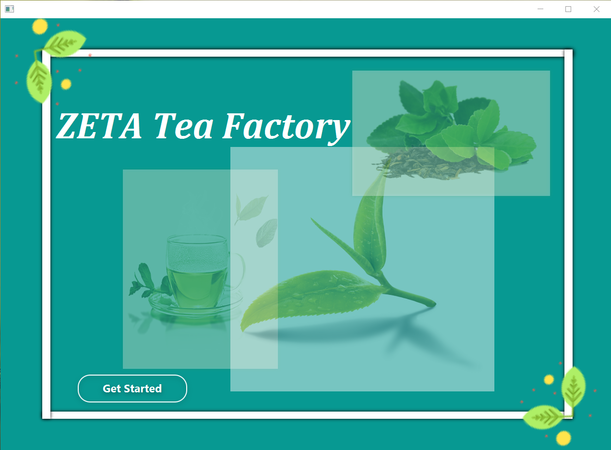

# *About* ❓
**This is my first Semester Final Project**.

<h3 align="center"></h3>

# *Introduction* 📝
There are many variations in the existing manual methodology for processing, managing and 
storing data in the process, from transporting tea leaves harvested from tea estates to storing 
them in tea factories. There are a number of hurdles in calculating data obtained from measuring 
tea leaves in factories. Also, the accuracy of the data obtained from that calculation is minimal.

There are also a number of issues with setting up payments for supplier leaves. That is, in the 
manual methodology that has taken place so far, the time taken for it increases, the accuracy of 
the data decreases, and the difficulty in storing and managing the data increases. There are also a 
number of issues with bill preparation. Figure 1.2 illustrates this manual methodology.
 
Therefore, my hope is that this proposed project will facilitate data input to factory users, speed 
up and compute calculations, and streamline data storage, management and data retrieval. My 
proposed project also seeks to expedite the calculation of payments to suppliers, facilitate the 
systematic maintenance of revenue records and storage records, print accurate bills for suppliers, 
provide a better user interface, and expedite the entire user process.

# Advantages of the solution 🔑
*  Elimination of difficulties in calculating data.
*  It is easy to retrieve data when needed.
*  Systematically can store large amounts of data.
*  Ease of bill preparation for suppliers.
*  Ease of report processing.
*  Being able to do this process in less time.
*  User friendly.
*  Access to information security.
*  Increased accuracy

# *Role* ✒
* Admin
* Manager

# *System Requirements* 📞
1. Add new tea species.
2. Add new employees.
3. Add Suppliers
4. Update Supplier, tea, employee details
5. Accept tea supply.
6. Issue ticket when tea stock supplied.
7. Calculate monthly annually, daily income.
8. Make Bill.

# *Details* 🔖
Below you can see the languages architectures, tools I used  the project.

## Architectures
* MVC 

## Design Patterns
* Singleton

## Language
* Java - JavaFX
* MySQL

## Tools
* IntelliJ IDEA
* Scene Builder